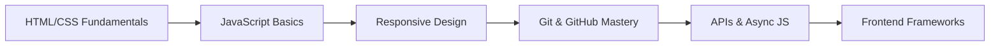

# 👋 Hi, I'm Amal Saleh  
### *Aspiring Fullstack Web Developer | Lifelong Learner*

---

## 🛠️ Tech Stack

---

## 📚 Currently Learning

| Technology | Status | Focus Areas |
|------------|--------|-------------|
| **HTML5 & CSS3** | 🟡 In Progress | Semantic HTML, Flexbox, Grid, Responsive Design |
| **JavaScript** | 🟡 In Progress | ES6+, DOM Manipulation, Async Programming |
| **Git & GitHub** | 🟢 Comfortable | Version Control, Collaboration, Workflows |

---

## 🎯 Certification Progress

### **freeCodeCamp – Responsive Web Design**

🔗 **[View my progress on freeCodeCamp](https://www.freecodecamp.org/saleh-coder)**

---

## 💻 Projects

> 🚧 *Projects below are currently in development. Links will be updated as they are completed.*

| Project | Status | Preview | Technologies |
|---------|--------|---------|-------------|
| **Survey Form** | ✅ Completed |  | HTML5, CSS3 |
| **Tribute Page** | ✅ Completed |  | HTML5, CSS3 |
| **Technical Documentation** | 🔄 In Progress |  | HTML5, CSS3, JS |
| **Product Landing Page** | 🔄 In Progress |  | HTML5, CSS3, JS |
| **Personal Portfolio** | 🔄 In Progress |  | HTML5, CSS3, JS |

---

## 📊 GitHub Analytics

 

---

## 🎯 Learning Roadmap

## 📫 Let's Connect

💡 Developer Philosophy
"Clean code is like humor. When you have to explain it, it's bad."
– Martin Fowler

⭐ Feel free to star my repositories if you find them interesting!

